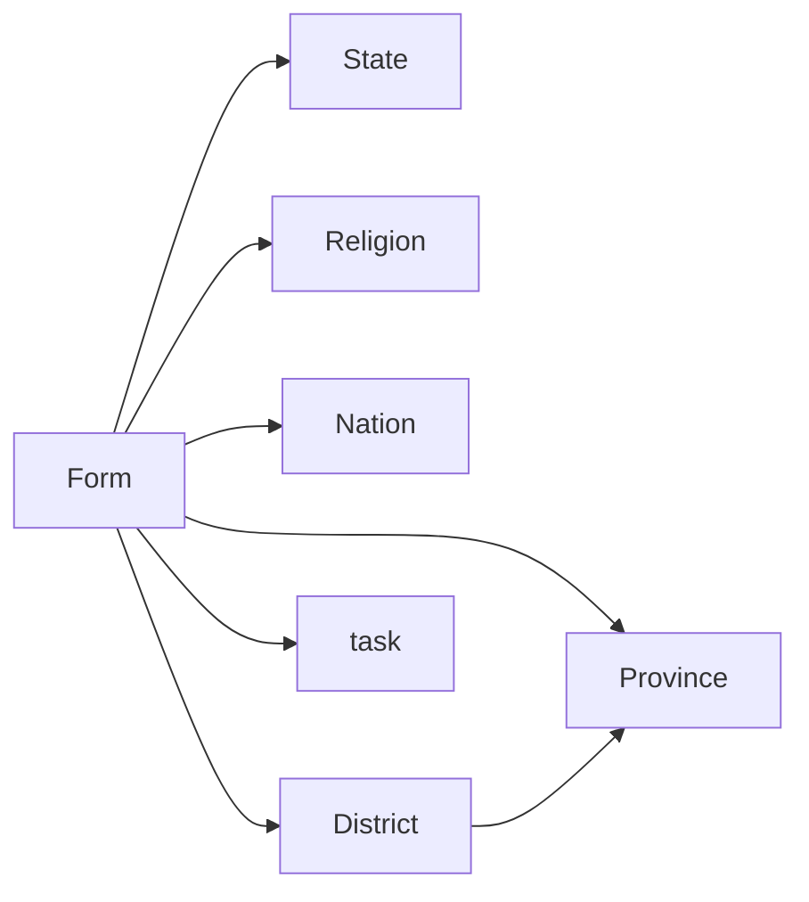
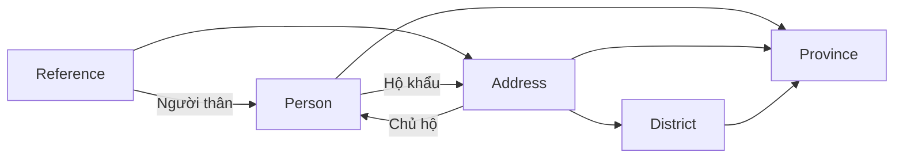

# Process

Xác thực (XT), Xét Duyệt (XD), Lưu trữ (LT), Giám sát (GS), Hệ thống (HT)

Cơ sở dữ liệu để đối chiếu thông tin: Resident

Cơ sở dữ liệu làm Passport:  Passport

Quy trình cấp hộ chiếu lần đầu:

```mermaid
sequenceDiagram
    participant ND
    participant HT
    participant XT
    participant XD
    participant LT
   	ND ->>+ HT: Đăng ký online <br>& hẹn lịch nộp
   	HT -->>- ND: Đăng ký và hẹn lịch <br> thành công
   	HT ->> XT: Chuyển thông tin và lịch hẹn
   	ND ->>+ XT: Nộp hồ sơ theo lịch
   	XT ->>+ HT: Cập nhật nhận hồ sơ
   	HT -->>- XT: Cập nhật thành công
   	HT -->>- ND: Hồ sơ được tiếp nhận
   	loop Xác thực
   		XT ->> XT: Xác thực thông tin hồ sơ
   	end
   	rect rgb(25,25,25)
   		alt xác thực thành công
   		XT ->>+ HT: Xác thực thành công
   		HT -->>- XT: Cập nhật trạng thái <br> thành công
   		HT ->> HT: Cập nhật trạng thái <br> chờ duyệt
   		HT ->> XD: Yêu cầu xét duyệt hồ sơ
   		loop Xét duyệt
   			XD ->> XD: Xét duyệt hồ sơ
   		end
   		rect rgb(50,60,50)
            alt duyệt
                XD ->>+ HT: Duyệt
                HT -->>- XD: Cập nhật thành công
                HT ->> HT: Cập nhật trạng thái duyệt
                HT ->> ND: Đã duyệt
                HT ->>+ LT: Yêu cầu lưu hồ sơ
                LT ->> LT: Lưu hồ sơ
                HT ->> HT: Chờ lưu
                LT -->>- HT: Lưu thành công
                HT ->> HT: Lưu thành công
            else không duyệt
                XD ->>+ HT: Không duyệt
                HT -->>- XD: Cập nhật thành công
                HT ->> HT: Cập nhật trạng thái không duyệt
                HT ->> ND: Không duyệt
            end
   		end
        else xác thực không thành công
        	XT ->>+ HT: Không xác thực
        	HT -->>- XT: Cập nhật thành công
        	HT ->>ND: Hồ sơ không xác thực 
        end
   	end
```

# Trạng thái đơn

- Chờ nộp (CN)
- Chờ xác thực (đã nộp) (CXT)
- Chờ duyệt (đã xác thực) (CD)
- Đã duyệt (DD)
- Chờ lưu (người dân không thấy) (CL)
- Đã lưu (người dân không thấy) (DL)
- Không duyệt (KD)
- Không xác thực (KXT)

# Bảng trong Passport



# Bảng trong Resident



# Database Passport

## Bảng Form

- FormID: Number(12)
- FormDate: Date
- Name: varchar2(50)
- Gender: varchar(5)
- Birthday: Date
- BirthPlace: varchar2(30)
- PID: varchar(15): NULL
- PIDDate: date: NULL
- PIDPlace: varchar2(15)(30): NULL
- Nation: varchar(10) **ref Nation**
- Religion: varchar(50) **ref Religion**
- AddressProvince: varchar2(30) **ref Province**
- AddressDistrict: varchar2(30) **ref District**
- AddressStreet: varchar2(200)
- TempAddProvince: varchar2(30): NULL **ref Province**
- TempAddDistrict: varchar2(30):NULL **ref District**
- TempAddStreet: text: NULL
- Job: text: NULL
- JobAddress: text: NULL
- FatherFullName: varchar2(50): NULL
- FatherBirthday: date: NULL
- MotherFullName: varchar2(50): NULL
- MotherBirthday: date: NULL
- HusbandWifeName: varchar2(50): NULL
- HusbandWifeBirthdat: date: NULL
- LastPassportNumber: varchar2(50): NULL
- LastPassportDate: date: NULL
- task: varchar2(5) **ref Task**
- taskNote: varchar(200): NULL
- ApointmentProvince: varchar2(30) **ref Province**
- ApointmentAddress: text
- FormState: varchar2(5) **ref State**

## Bảng State

- StateId: varchar2(5)
- StateName: varchar2(50)

## Bảng Religion

- ReligionId: varchar2(5)
- ReligionName: varchar2(50)

## Bảng Nation

- NationId: varchar2(5)
- NationName: varchar2(50)

## Bảng Task

- TaskId: varchar2(5)

- TaskName: text

## Bảng Province

- ProvinceId: varchar2(5)
- ProvinceName: varchar2(50)

## Bảng District

- ProvinceId: varchar2(5) **ref Province**
- DistrictId: varchar2(5)
- DistrictName: varchar2(50)

# Database Resident

## Bảng Person

- PersonalNumber: Number(13)
- PID: varchar2(15): NULL
- PIDPlace: **ref Province**: NULL
- PIDDate: date: NULL
- Name: varchar2(50)
- Gender: varchar2(5)
- BirthDay: date
- BirthPlace: varchar2(5) **ref Province**
- AddressId: varchar2(20) **ref Address**

## Bảng Address

- AddressId: varchar2(20)
- AddressProvince: varchar2(5) **ref Province**
- AddressDistrict: varchar2(5) **ref District**
- AddressStreet: text
- AddressHost: Number(13) **ref Person**

## Bảng Reference

- PersonalNumber1: Number(13)
- PersonalNumber2: Number(13)
- Relationship: varchar2(20)
- Address: varchar2(20) **ref Address**

## Bảng Province

- ProvinceId: varchar2(5)
- ProvinceName: varchar2(50)

## Bảng District

- ProvinceId: varchar2(5) **ref Province**
- DistrictId: varchar2(5)
- DistrictName: varchar2(50)

