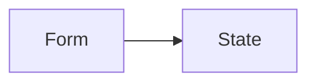
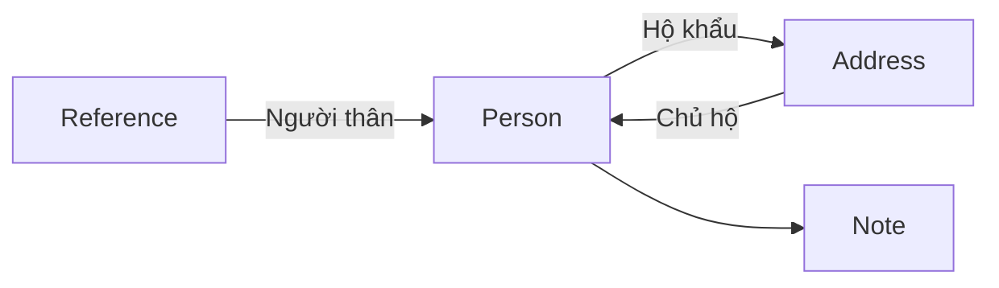

# Process

Xác thực (XT), Xét Duyệt (XD), Lưu trữ (LT), Giám sát (GS), Hệ thống (HT)

Cơ sở dữ liệu để đối chiếu thông tin: Resident

Cơ sở dữ liệu làm Passport:  Passport

Quy trình cấp hộ chiếu lần đầu:

```mermaid
sequenceDiagram
    participant ND
    participant HT
    participant XT
    participant XD
    participant LT
   	ND ->>+ HT: Đăng ký online <br>& hẹn lịch nộp
   	HT -->>- ND: Đăng ký và hẹn lịch <br> thành công
   	HT ->> XT: Chuyển thông tin và lịch hẹn
   	ND ->>+ XT: Nộp hồ sơ theo lịch
   	XT ->>+ HT: Cập nhật nhận hồ sơ
   	HT -->>- XT: Cập nhật thành công
   	HT -->>- ND: Hồ sơ được tiếp nhận
   	loop Xác thực
   		XT ->> XT: Xác thực thông tin hồ sơ
   	end
   	rect rgb(200,200,200)
   		alt xác thực thành công
   		XT ->>+ HT: Xác thực thành công
   		HT -->>- XT: Cập nhật trạng thái <br> thành công
   		HT ->> HT: Cập nhật trạng thái <br> chờ duyệt
   		HT ->> XD: Yêu cầu xét duyệt hồ sơ
   		loop Xét duyệt
   			XD ->> XD: Xét duyệt hồ sơ
   		end
   		rect rgb(180,180,180)
            alt duyệt
                XD ->>+ HT: Duyệt
                HT -->>- XD: Cập nhật thành công
                HT ->> HT: Cập nhật trạng thái duyệt
                HT ->> ND: Đã duyệt
                HT ->>+ LT: Yêu cầu lưu hồ sơ
                LT ->> LT: Lưu hồ sơ
                HT ->> HT: Chờ lưu
                LT -->>- HT: Lưu thành công
                HT ->> HT: Lưu thành công
            else không duyệt
                XD ->>+ HT: Không duyệt
                HT -->>- XD: Cập nhật thành công
                HT ->> HT: Cập nhật trạng thái không duyệt
                HT ->> ND: Không duyệt
            end
   		end
        else xác thực không thành công
        	XT ->>+ HT: Không xác thực
        	HT -->>- XT: Cập nhật thành công
        	HT ->>ND: Hồ sơ không xác thực 
        end
   	end
```

# Trạng thái đơn

- Chờ nộp (CN)
- Chờ xác thực (đã nộp) (CXT)
- Chờ duyệt (đã xác thực) (CD)
- Đã duyệt (DD)
- Chờ lưu (người dân không thấy) (CL)
- Đã lưu (người dân không thấy) (DL)
- Không duyệt (KD)
- Không xác thực (KXT)

# Bảng trong Passport



# Bảng trong Resident



